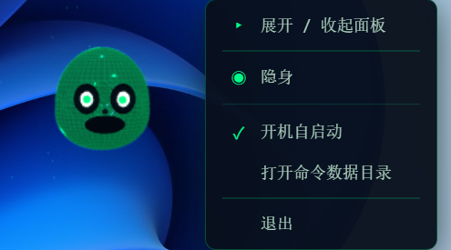
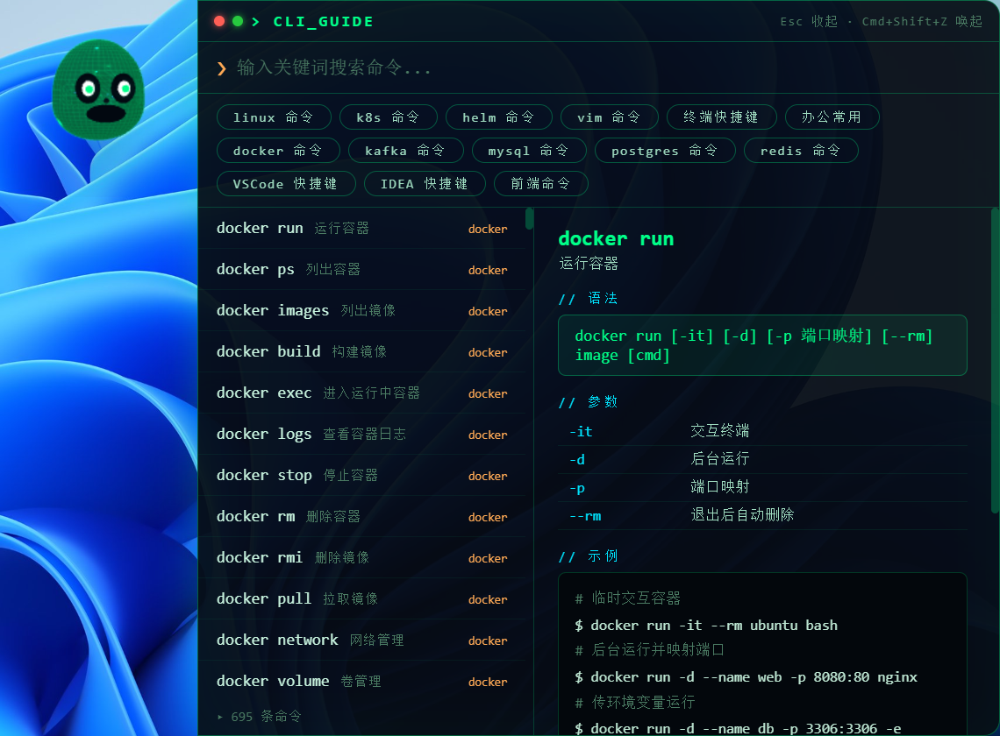

# 👾 CLI-GUIDE

[](LICENSE)
[](https://github.com/LiLinhua/cli-guide)
[](https://www.electronjs.org/)
[](https://github.com/LiLinhua/cli-guide/releases/tag/v0.1.0)

<p align="center">
  
</p>

> 常驻桌面的 3D 终端脸桌宠命令手册（**macOS / Windows**）。  
> 点击桌宠唤起搜索面板，快速检索 **14 大分类 · 695 条命令 · 4622 个示例**，一键复制。

**10 秒上手**：`Cmd/Ctrl+Shift+Z` 唤起面板 → 输入关键词（如 `kubectl` / `docker`）→ Enter 复制。

### 预览

<p align="center">
  
</p>

<p align="center">
  
</p>

<p align="center">
  <em>命令搜索面板 · 桌宠右键菜单（展开 / 隐身 / 开机自启动）</em>
</p>

---

## 📥 安装

### 方式一：下载安装包（推荐）

到 [Releases v0.1.0](https://github.com/LiLinhua/cli-guide/releases/tag/v0.1.0) 下载：

| 平台 | 文件 | 说明 |
| --- | --- | --- |
| **Windows** | [CLI-GUIDE.Setup.0.1.0.exe](https://github.com/LiLinhua/cli-guide/releases/download/v0.1.0/CLI-GUIDE.Setup.0.1.0.exe) | NSIS 安装包（可改安装目录） |
| **Windows** | [CLI-GUIDE.0.1.0.exe](https://github.com/LiLinhua/cli-guide/releases/download/v0.1.0/CLI-GUIDE.0.1.0.exe) | 绿色免安装，双击即用 |
| **macOS** | — | 暂未提供预编译包，请用下方源码运行，或本机 `npm run dist:mac` |

> Windows 未签名时 SmartScreen 可能拦截：选「更多信息 → 仍要运行」。  
> macOS Gatekeeper 拦截时：**右键 → 打开**，或执行 `xattr -cr /Applications/CLI-GUIDE.app`。

本地自行打包：

```bash
npm install
npm run dist:win    # → release/CLI-GUIDE Setup 0.1.0.exe + CLI-GUIDE 0.1.0.exe
npm run dist:mac    # 仅能在 macOS 上执行 → dmg + zip
npm run dist        # 按当前系统打包
```

### 方式二：从源码运行

需 **Node.js 22+**（Electron 43 要求）：

```bash
npm install
npm start
```

也可用 Web 版零安装体验，见下方 [从源码运行](#-从源码运行)。

---

## ✨ 功能亮点

- **3D 桌宠**：Three.js「终端脸」——Matrix 字符流、发光眼睛、眨眼/浮动/点击动画；无 WebGL 自动降级 CSS
- **点击即查**：单击桌宠弹出宽面板，左列表右详情
- **实时搜索**：命令名 / 描述 / 标签模糊匹配，命中高亮，↑↓ 选择，Enter 复制
- **示例丰富**：每条命令 2–7 个示例，覆盖单用 / 组合 / 管道 / 进阶
- **14 大分类**：
  - 系统运维：`linux` / `docker` / `kafka` / `mysql` / `postgres` / `redis`
  - 云原生：`k8s` / `helm`
  - 前端：`前端命令`（npm / pnpm / vite / next / vue / eslint / playwright…）
  - 编辑器：`vim` / `VSCode 快捷键` / `IDEA 快捷键`
  - 其他：`终端快捷键` / `办公常用(git·macOS·tmux)`
- **自定义命令库**：首次启动复制到用户目录，编辑 JSON 即可增删改
- **全局快捷键**：`Cmd+Shift+Z`（macOS）/ `Ctrl+Shift+Z`（Windows）
- **开机自启动**：托盘菜单一键开关（默认关闭）
- **黑客风 UI**：矩阵绿霓虹 / 深黑蓝底 / 扫描线 / 字符流

---

## 🚀 从源码运行

### 客户端版（Electron）

环境：**Node.js 22+**。

```bash
npm install
npm start
```

- 使用项目内 `.npmrc`（`registry.npmmirror.com`），`postinstall` 通过 `scripts/ensure-electron.js` 从国内镜像拉取 Electron
- 命令数据目录：`~/.cli-guide/commands/`（Windows：`%USERPROFILE%\.cli-guide\commands\`）

### Web 版（单文件 HTML，零安装）

适合无法安装 Electron 的受限环境：

```bash
npm run build:web
# 生成 dist/cli-guide-web.html
```

双击用 Chrome / Edge / Safari 打开即可。

| 能力 | 客户端版 | Web 版 |
| --- | --- | --- |
| 3D 桌宠 / 面板 / 搜索 / 复制 | ✅ | ✅（面板常驻居中，无桌宠） |
| 全局快捷键 Cmd/Ctrl+Shift+Z | ✅（任意焦点） | ✅（页面内焦点） |
| 开机自启动 / 托盘 | ✅ | ✅ 自启动（Chrome 应用模式）/ ❌ 托盘 |
| 窗口拖动 / 位置记忆 | ✅ | ❌（固定居中） |
| 自定义命令库 | ✅ 用户目录 | ❌（内置库） |

> Web 版复制依赖浏览器剪贴板权限；被拦截时会降级为传统复制。

### Web 版桌面常驻（Chrome 应用模式 + 开机自启动）

> **场景**：公司电脑管控拦截自研 Electron 时，用 Chrome `--app` 模式跑 Web 版。

**1. 构建**

```bash
npm run build:web
```

**2. 创建启动器**（macOS，一次性）

```bash
mkdir -p ~/Applications
osacompile -o ~/Applications/CLI-GUIDE-Web.app -e 'do shell script "open -na \"/Applications/Google Chrome.app\" --args --app=\"file://<项目绝对路径>/dist/cli-guide-web.html\" --user-data-dir=\"$HOME/.cli-guide/chrome-profile\" --window-size=900,700"'
```

把 `<项目绝对路径>` 换成实际路径。

**3. 启动方式**

| 方式 | 操作 |
| --- | --- |
| Spotlight | `Cmd+Space` → `CLI-GUIDE-Web` |
| 双击 | `~/Applications/CLI-GUIDE-Web` |
| 终端 | 见下方完整命令 |

**4. 开机自启动**

- GUI：系统设置 → 通用 → 登录项 → 添加 `~/Applications/CLI-GUIDE-Web.app`
- 命令行：

```bash
osascript -e 'tell application "System Events" to make login item at end with properties {path:"/Users/<用户名>/Applications/CLI-GUIDE-Web.app", hidden:false}'
```

**5. 完整启动命令**

```bash
open -na "/Applications/Google Chrome.app" --args \
  --app="file://<项目绝对路径>/dist/cli-guide-web.html" \
  --user-data-dir="$HOME/.cli-guide/chrome-profile" \
  --window-size=900,700
```

- `--app=`：无地址栏独立窗口  
- `--user-data-dir=`：**必带**，否则会并入已运行的 Chrome，导致 `--app` 失效  
- 常驻模式：`Esc` 不收起；`Cmd/Ctrl+Shift+Z` 切换显示/隐藏  

### 打包要点

- `dist:win` → x64；`dist:mac` → 默认 arm64（Intel 用 `npx electron-builder --mac --x64`）
- 配置见 `package.json` → `build`；图标：`build/icon.icns`（mac）/ `resources/icon-1024.png`（win）
- 已配置 `electronDist` 复用本地 Electron；`ensure-electron.js` 默认走 npmmirror

---

## ⌨️ 操作

| 操作 | 效果 |
| --- | --- |
| 单击桌宠 / `Cmd+Shift+Z`（mac）/ `Ctrl+Shift+Z`（win） | 展开 / 收起面板 |
| 右键桌宠 | 菜单：展开/收起、隐身、开机自启动、数据目录、退出 |
| 拖拽桌宠 | 移动位置（自动记忆） |
| Esc / 点击面板外 | 收起 |
| 面板左上角红点 | 收起 |
| 面板左上角绿点 | 放大 / 还原 |
| ↑↓ / Enter | 列表导航 / 复制 |
| 点击分类 chip | 限定分类（再点取消） |

---

## 🛠 自定义命令

编辑用户目录下的 JSON（与 `resources/commands/*.json` 同名，如 `k8s.json`、`frontend.json`），重启生效：

- macOS / Linux：`~/.cli-guide/commands/`
- Windows：`%USERPROFILE%\.cli-guide\commands\`

**格式一：补充命令**（JSON 数组）

```json
[
  {
    "id": "my-ls", "cmd": "ls -lh", "cat": "linux", "desc": "人类可读大小列目录",
    "syntax": "ls [-lh] [path]", "args": [{ "name": "-h", "desc": "容量单位" }],
    "examples": [{ "cmd": "ls -lh", "comment": "查看当前目录" }], "tags": ["目录"]
  }
]
```

**格式二：新增分类**（JSON 对象）

```json
{
  "cat": "git",
  "label": "git 命令",
  "order": 14,
  "commands": [
    {
      "id": "git-status", "cmd": "git status", "cat": "git", "desc": "查看工作区状态",
      "syntax": "git status [-s]", "args": [{ "name": "-s", "desc": "简短输出" }],
      "examples": [{ "cmd": "git status", "comment": "查看状态" }], "tags": ["git"]
    }
  ]
}
```

> 内置库仅在首次启动时复制到用户目录。升级后若要同步内置修正，删除对应用户 JSON 后重启即可重新复制。

---

## 🤝 参与贡献

欢迎提 Issue / PR，尤其欢迎：

- 补充或勘误 `resources/commands/*.json` 命令与示例
- 补充演示 GIF / 更多截图（现有预览见 `assets/imgs/`）
- Windows / macOS 体验与打包问题反馈

```bash
npm test   # commands / search / layout / panel / smoke / build-web / style
```

---

## 📁 项目结构

| 路径 | 职责 |
| --- | --- |
| `main.js` | Electron 主进程：窗口 / 快捷键 / 自启动 / 托盘 / IPC |
| `preload.js` | `window.cliGuide` API |
| `lib/commands.js` | 命令数据层 |
| `lib/layout.js` | 窗口布局 |
| `resources/commands/*.json` | 14 个分类内置库 |
| `assets/imgs/` | README 预览图（桌宠 / 面板 / 菜单） |
| `renderer/` | 桌宠 + 面板 UI |
| `web/cli-guide-web.js` | Web 版 shim |
| `scripts/ensure-electron.js` | postinstall 拉取 Electron |
| `scripts/build-web.js` | 构建单文件 Web 版 |
| `.npmrc` | `registry.npmmirror.com` |

---

## ❓ 常见问题

- **桌宠没有 3D？** 无 WebGL 时自动降级 CSS 终端脸，功能不变。
- **找不到托盘？** macOS 在菜单栏；Windows 在任务栏托盘（可能在 `^` 收纳区）。
- **开机自启动无效？** macOS 需在「隐私与安全性」放行；Windows 可在托盘菜单或「设置 → 应用 → 启动」确认。
- **Windows 安装被拦截？** SmartScreen →「更多信息 → 仍要运行」。
- **`npm install` 很慢？** 确认使用项目 `.npmrc`；Electron 由 `postinstall` 走镜像。
- **安装报错 / Electron 起不来？** 确认 Node.js ≥ 22（建议 LTS 22+）。

---

## 📄 License

[MIT](LICENSE) © LiLinhua
